#Jenkins-X 石雪峰介绍
@(Jenkins-X)[Kubernetes|Docker|CI/DI]
**Jenkins-X**基于Kubernetes的新一代CI/DI解决方案；
- **概念**：Kubernetes的新一代CI/DI解决方案，用于云原生应用的开发部署；
- **设计理念**：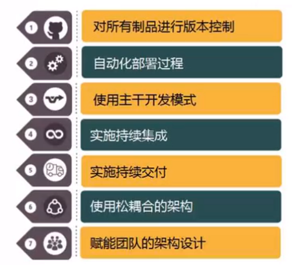
- **特性**：自动化CI/DI；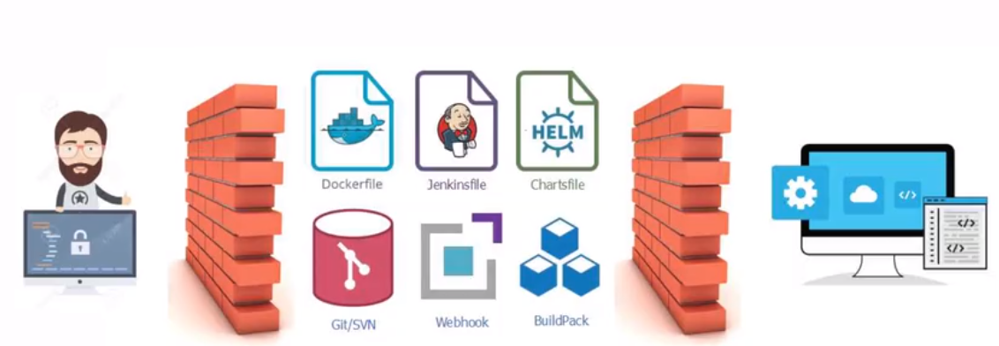
-  **基于GitOps部署**：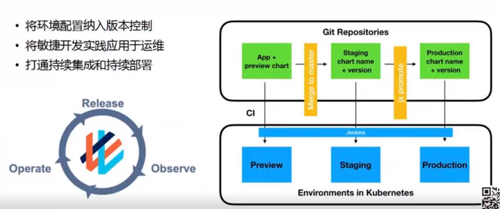
-  **环境灵活管理**：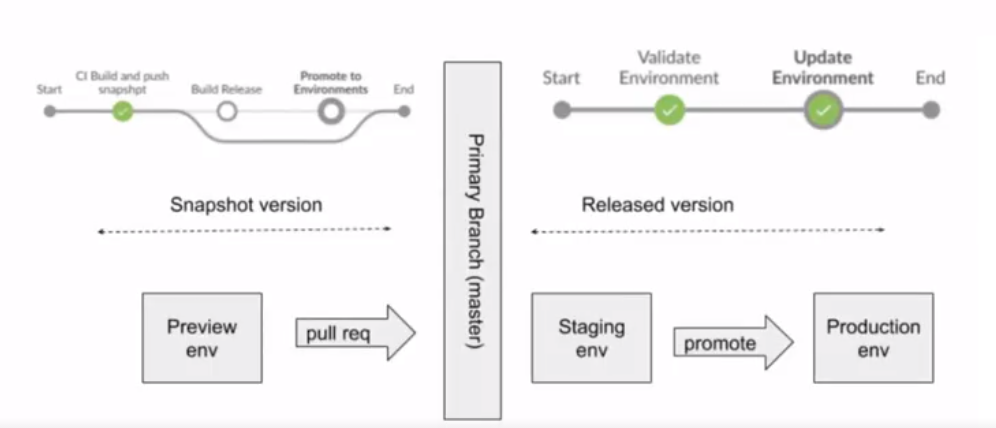
-  **工作流程**：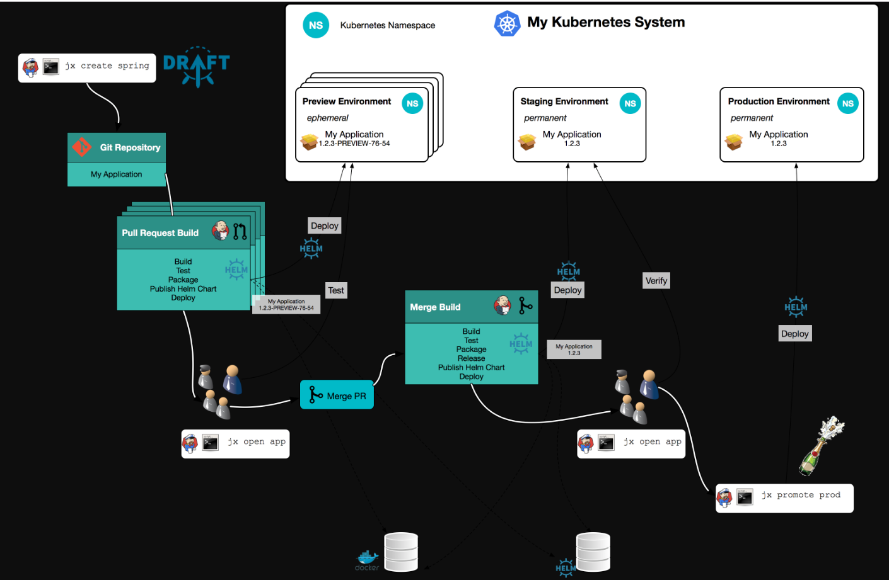
- **命令行工具**：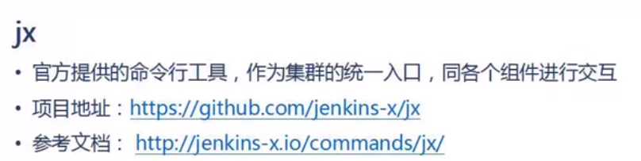
- **组件——应用包管理**：[**Helm**](https://github.com/helm/helm)和[**Chartmuseum**](https://github.com/helm/chartmuseum)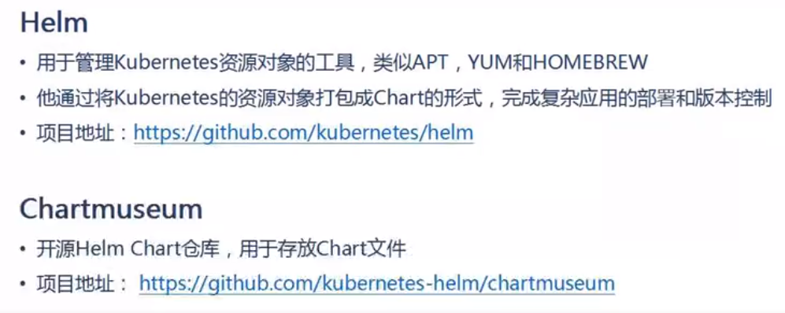
- **组件——可视化包管理**：[**Monocular**](https://github.com/helm/monocular)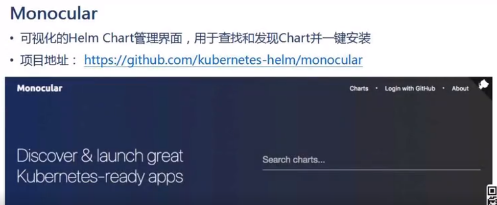
- **组件——制品管理工具**：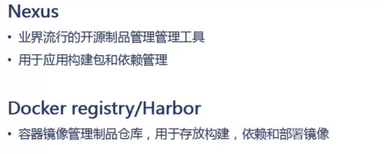
- **组件——构建工具**：[**Draft**](https://github.com/Azure/draft)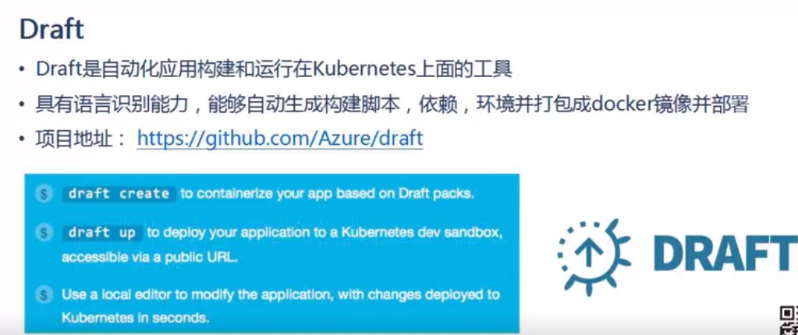
- **扩展功能——DevPod**：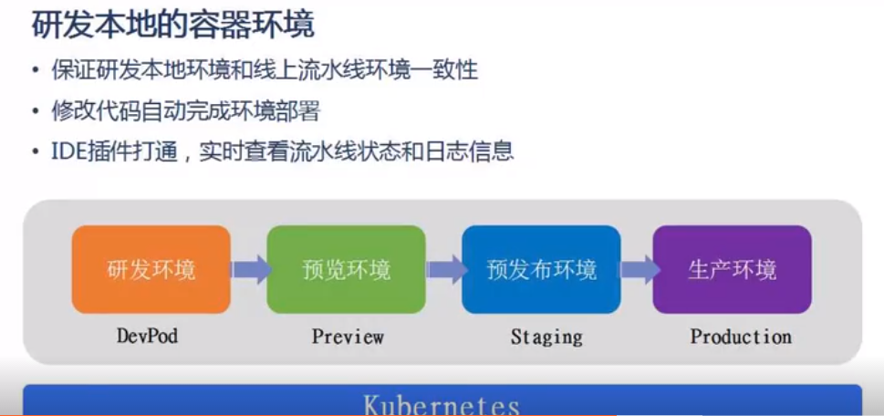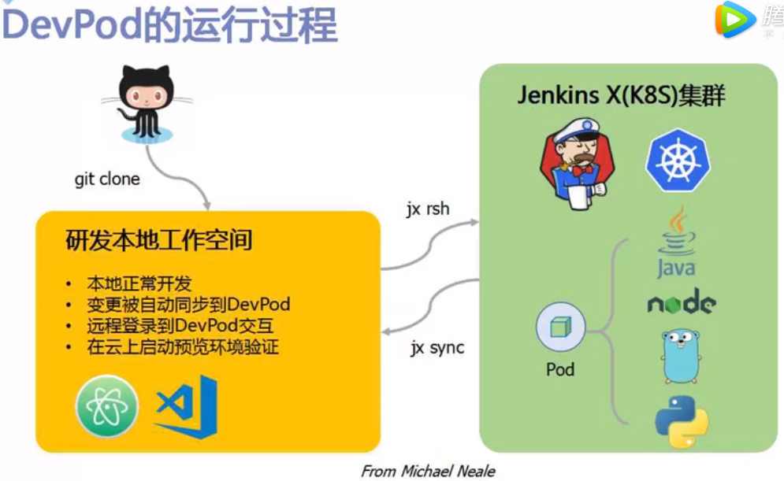
- **扩展功能——Skaffold**：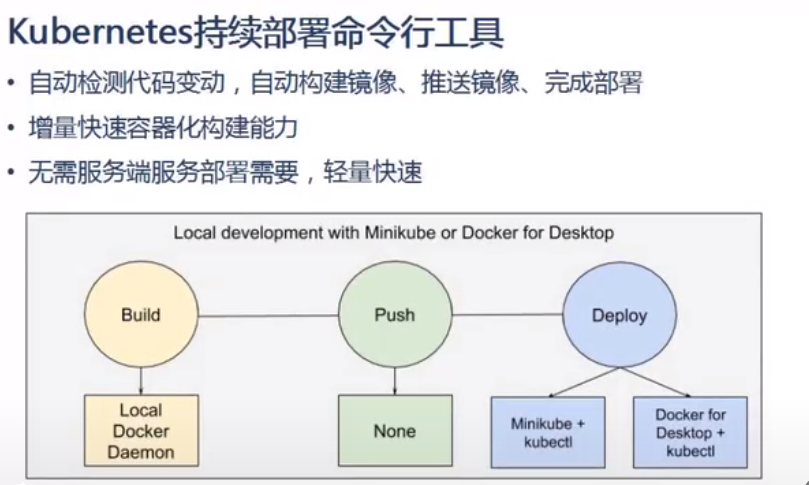
- **扩展功能——安全检测Anchore**：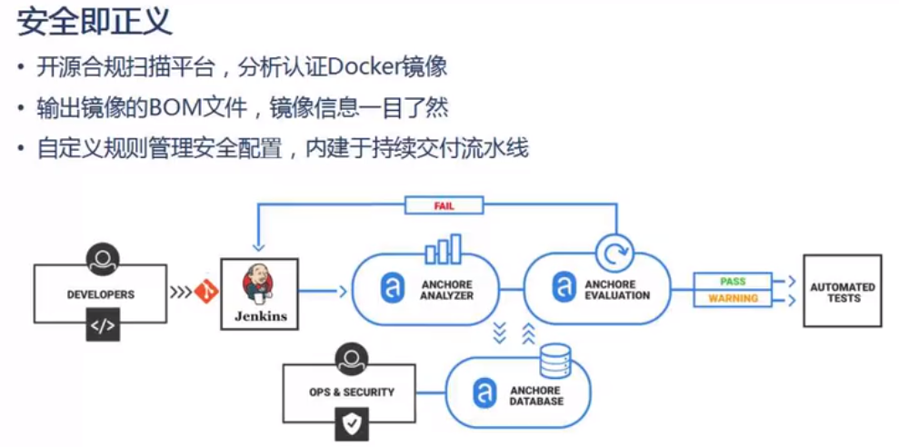
- **扩展功能——安全检测ZAP**：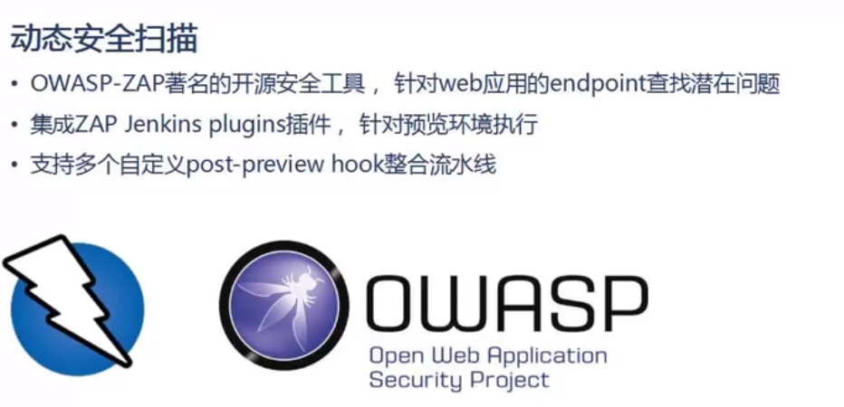
##Jenkins-X安装过程

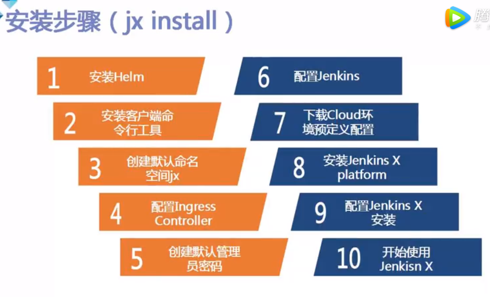

##参考
[基于Kubernetes的CICD平台-石雪峰|可信云](https://v.qq.com/x/page/i0779x8pza5.html)
